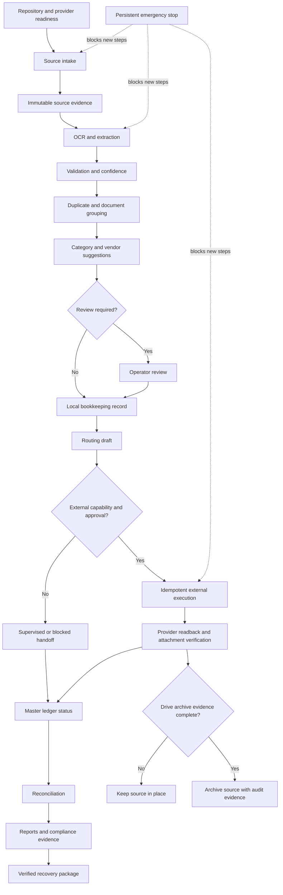

# Task Graph

## Stabilization order

1. Repository/configuration/readiness.
2. Local critical path and invariant tests.
3. Operator review and safety controls.
4. Provider capability and approval boundaries.
5. Recovery, diagnostics, and audit evidence.
6. Live provider acceptance.
7. Deployment, security, privacy, and human acceptance sign-off.
