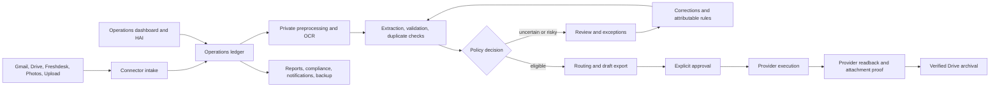

# Authoritative Module Interfaces

FAB uses the SQLite operations ledger as its source of truth. Connector intake, document processing, review, routing, export approval, provider execution/readback, reporting, compliance, notification, and archival evidence all attach to that ledger. A module must not maintain a parallel queue or claim external success without durable readback evidence.

## Runtime Flow

## Owned Boundaries

### Worker

- Owner: `src/worker/scheduler.py` (`FabWorker`).
- Input: flattened runtime configuration and the owned SQLite ledger.
- Output: independent, audited stage results.
- Safety: a Windows/runtime ownership lock prevents overlapping recurring and one-shot workers. A stale `worker_run_legacy_workflow=true` setting fails startup because the duplicate controller was retired.

### Connector Intake

- Owners: `src/operations/local_connector_intake.py` and connector-specific fetchers/relays.
- Input: explicitly enabled, authorized connector configuration.
- Output: immutable source identity, content hash, local document registration, and workflow evidence.
- Safety: non-interactive workers never open OAuth or Photos Picker consent. Intake is idempotent and one connector failure does not suppress later worker stages.

### Document Processing

- Owner: `src/operations/local_processing.py` with `src/document_processors/processor_pipeline.py`.
- Input: a ledger-owned source document.
- Output: OCR evidence, normalized financial fields, confidence, validation findings, duplicate candidates, and processing status.
- Safety: derived images use a private temporary directory and are removed after success or failure. Heavy OCR/ML dependencies load only when the selected stage needs them.

### Vendor Templates

- Owner: `src/document_processors/template_matching_processor.py`.
- Input: OCR text plus `vendor_templates`, `vendor_templates_file`, or sorted JSON files in `template_matching_templates_dir`.
- Output: normalized vendor, date, amounts, currency, line items, per-field confidence, and template attribution.
- Safety: malformed files, schemas, and regular expressions are isolated in `template_errors`; they cannot fabricate a match or abort all document processing.

### Review, Exceptions, and Corrections

- Owners: `src/operations/local_review.py`, `src/operations/local_exceptions.py`, and `src/learning/correction_learning.py`.
- Input: ledger document/workflow identifiers, operator-authenticated decisions, correction evidence, and explicit confirmation where required.
- Output: versioned review decisions, resolved or open exceptions, audit events, and attributable category-rule suggestions.
- Safety: there is no file-backed review queue. Correction learning uses real persisted documents and never invents OCR/provider history.

### Routing and Bookkeeping Records

- Owners: `src/operations/local_routing.py`, `src/operations/local_bookkeeping_records.py`, and `src/operations/local_master_ledger.py`.
- Input: validated fields, category policy, source identity, reconciliation evidence, and configured target accounts.
- Output: normalized bookkeeping records and target-specific draft operations.
- Safety: incomplete, duplicate, low-confidence, or policy-blocked records remain reviewable instead of being silently posted.

### Exports and Provider Execution

- Owners: `src/operations/local_exports.py`, `src/operations/drive_wave_delivery.py`, and supervised target handlers.
- Input: immutable operation payload, approval state, idempotency key, and available provider authorization.
- Output: export attempt, external identifier, attachment evidence, readback state, and audit history.
- Safety: preparing or approving an attempt does not itself submit externally. Archival requires verified provider record and attachment readback; absence or ambiguity fails closed.

### Reporting and Compliance

- Owners: `src/operations/local_reporting.py` and `src/operations/local_compliance.py`.
- Input: normalized, deduplicated ledger records and period filters.
- Output: checksum-bound local reports and provisional VAT/retention assessments.
- Safety: generated tax material is explicitly provisional. FAB does not claim a Dutch filing or statutory submission without a separately approved connector and acceptance evidence.

### Recovery and Notifications

- Owners: `src/operations/local_workflow_recovery.py` and `src/operations/local_notifications.py`.
- Input: recorded failed steps, current recovery policy, health state, and notification preferences.
- Output: linked retry runs and idempotent inbox events.
- Safety: retries cannot select approved external execution. Outbound notification delivery remains disabled until recipient and delivery-attempt governance exists.

### API, Dashboard, and HAI

- Owners: `src/operations/local_api.py`, `web/server/routers.ts`, `web/client/src/pages/admin/Operations.tsx`, and `src/operations/local_hai_connector.py`.
- Input: authenticated local operator or service requests.
- Output: bounded projections, operator commands, workflow evidence, and HAI plans/resources.
- Safety: API and HAI contracts expose explicit local, approval, execution, and provider states. HAI external mutations remain policy-gated and disabled by default.

### Backup and Restore

- Owner: `src/operations/local_backup.py`.
- Input: ledger/runtime files under the configured backup policy.
- Output: atomic backup artifacts, manifests, checksums, restore previews, and audit evidence.
- Safety: restore is confirmation-gated and verified. Provider data and Google Drive source files are not deleted as a side effect of backup.

## Historical Import

Historical data enters through authenticated document upload, connector intake, or bank-statement import. Each route normalizes into the same ledger and duplicate/review contracts. The retired interactive migration wizard and direct provider migration path must not be restored as a parallel source of truth.

## Failure Contract

Every externally visible operation must distinguish at least `not_run`, `prepared`, `approval_required`, `executed`, `verified`, `supervision_required`, and `failed` where applicable. Logs alone are not completion evidence. A provider mutation is complete only after the external identifier and required readback evidence are persisted.
