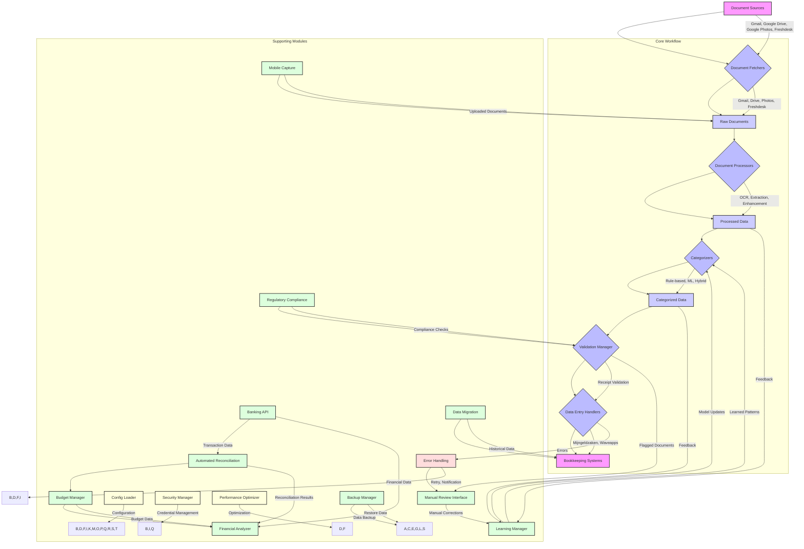

# Technical Reference for Automated Bookkeeping Solution

This document provides a detailed technical overview of the Automated Bookkeeping Solution, including its architecture, module interfaces, data flows, and key implementation details. It is intended for developers, system administrators, and anyone looking to understand or extend the system.

## 1. Architecture Overview

The Automated Bookkeeping Solution follows a modular, pipeline-based architecture, designed for extensibility and maintainability. Each core function (fetching, processing, categorization, data entry) is encapsulated within its own module, communicating through well-defined interfaces.



## 2. Module Interfaces and Data Flow

### 2.1. `src/workflow/controller.py` (`WorkflowController`)

*   **Purpose**: Orchestrates the entire document processing workflow. It initializes and coordinates all other modules.
*   **Key Methods**:
    *   `run_workflow()`: Main entry point for the workflow. Fetches documents, processes them through the pipeline, categorizes, validates, and dispatches to data entry handlers.
*   **Data Flow**: Pulls documents from fetchers, pushes to processors, then to categorizers, validators, and finally to data entry handlers.

### 2.2. `src/config_loader.py` (`ConfigLoader`)

*   **Purpose**: Manages application configuration, loading settings from `config.ini` and environment variables.
*   **Key Methods**:
    *   `get(section, key, default)`: Retrieves a specific configuration value.
    *   `get_section(section)`: Retrieves all key-value pairs for a given section.
    *   `get_all_config()`: Returns the entire loaded configuration as a dictionary.
*   **Data Flow**: Provides configuration data to all modules that require it.

### 2.3. `src/workflow/logger.py` (`AppLogger`)

*   **Purpose**: Centralized logging utility for the application.
*   **Key Methods**:
    *   `get_logger()`: Returns a configured Python `logging.Logger` instance.
*   **Data Flow**: Receives log messages from all modules and writes them to the configured log file or standard output.

### 2.4. `src/security/security_manager.py` (`SecurityManager`)

*   **Purpose**: Handles secure storage and retrieval of sensitive information (e.g., API keys, passwords) using encryption.
*   **Key Methods**:
    *   `encrypt_data(data)`: Encrypts a given string.
    *   `decrypt_data(encrypted_data)`: Decrypts an encrypted string.
*   **Data Flow**: Used by modules that handle sensitive credentials (fetchers, data entry handlers) to encrypt/decrypt data.

### 2.5. `src/document_fetchers/base.py` (`BaseFetcher`)

*   **Purpose**: Abstract base class defining the interface for all document fetching modules.
*   **Key Methods (Abstract)**:
    *   `fetch_documents() -> List[Dict[str, Any]]`: Fetches documents from a source and returns a list of dictionaries, each containing `id`, `original_filename`, `local_path`, and `source`.

### 2.6. `src/document_fetchers/gmail_fetcher.py` (`GmailFetcher`)

*   **Purpose**: Fetches email attachments from Gmail using the Gmail API.
*   **Dependencies**: `google-api-python-client`, `google-auth-oauthlib`.
*   **Configuration**: `gmail_credentials_file`, `gmail_token_file`, `gmail_attachment_download_dir`, `gmail_search_query`.

### 2.7. `src/document_fetchers/drive_fetcher.py` (`DriveFetcher`)

*   **Purpose**: Fetches files from Google Drive using the Google Drive API.
*   **Dependencies**: `google-api-python-client`, `google-auth-oauthlib`.
*   **Configuration**: `google_drive_credentials_file`, `google_drive_token_file`, `google_drive_download_dir`, `google_drive_folder_id`, `google_drive_file_types`.

### 2.8. `src/document_fetchers/freshdesk_fetcher.py` (`FreshdeskFetcher`)

*   **Purpose**: Fetches attachments from Freshdesk tickets using the Freshdesk API.
*   **Dependencies**: `requests`.
*   **Configuration**: `freshdesk_api_key`, `freshdesk_domain`, `freshdesk_download_dir`, `freshdesk_ticket_status`.

### 2.9. `src/document_fetchers/photos_fetcher.py` (`PhotosFetcher`)

*   **Purpose**: Fetches media items (images) from Google Photos using the Photos Library API.
*   **Dependencies**: `google-api-python-client`, `google-auth-oauthlib`, `requests`.
*   **Configuration**: `google_photos_credentials_file`, `google_photos_token_file`, `google_photos_album_name`, `google_photos_download_dir`.

### 2.10. `src/document_processors/base.py` (`BaseProcessor`)

*   **Purpose**: Abstract base class defining the interface for all document processing modules.
*   **Key Methods (Abstract)**:
    *   `process_document(file_path: str, **kwargs) -> Dict[str, Any]`: Processes a document and returns extracted data and OCR text.

### 2.11. `src/document_processors/vision_processor.py` (`VisionProcessor`)

*   **Purpose**: Uses Google Cloud Vision API for advanced OCR and document understanding.
*   **Dependencies**: `google-cloud-vision`.
*   **Configuration**: `google_vision_credentials_file`.

### 2.12. `src/document_processors/tesseract_processor.py` (`TesseractProcessor`)

*   **Purpose**: Uses Tesseract OCR engine for text extraction from images/PDFs.
*   **Dependencies**: `pytesseract`, `Pillow`.
*   **Configuration**: `tesseract_cmd`, `tesseract_lang`.

### 2.13. `src/document_processors/dutch_ocr_processor.py` (`DutchOcrProcessor`)

*   **Purpose**: Specialized Tesseract processor for Dutch language documents.
*   **Dependencies**: `pytesseract`, `Pillow`.
*   **Configuration**: `dutch_ocr_lang`.

### 2.14. `src/document_processors/handwritten_recognition_processor.py` (`HandwrittenRecognitionProcessor`)

*   **Purpose**: Processes documents to extract handwritten text using a specialized model.
*   **Dependencies**: (Assumes a custom model and its dependencies, e.g., `torch`, `torchvision` if PyTorch-based).
*   **Configuration**: `handwritten_model_path`.

### 2.15. `src/document_processors/template_matching_processor.py` (`TemplateMatchingProcessor`)

*   **Purpose**: Extracts structured data from documents based on predefined templates and keyword matching.
*   **Dependencies**: (None specific beyond Python built-ins).
*   **Configuration**: `template_matching_templates_dir`.

### 2.16. `src/document_processors/line_item_extractor.py` (`LineItemExtractor`)

*   **Purpose**: Extracts individual line items (e.g., product, quantity, price) from invoices or receipts.
*   **Dependencies**: (Potentially `re` for regex, `pandas` for data structuring).

### 2.17. `src/document_processors/enhanced_processor.py` (`EnhancedProcessor`)

*   **Purpose**: Combines multiple processing techniques (e.g., OCR + line item extraction) for comprehensive data extraction.
*   **Dependencies**: Depends on other processors.
*   **Configuration**: `ocr_processor`, `line_item_extraction_enabled`.

### 2.18. `src/document_processors/vendor_template_processor.py` (`VendorTemplateProcessor`)

*   **Purpose**: Extracts data based on vendor-specific templates and rules.
*   **Dependencies**: (None specific beyond Python built-ins).
*   **Configuration**: `vendor_templates_file`.

### 2.19. `src/document_processors/bilingual_processor.py` (`BilingualProcessor`)

*   **Purpose**: Detects document language and routes to the appropriate language-specific OCR processor (e.g., Dutch or English).
*   **Dependencies**: `langdetect`, `pytesseract`, `google-cloud-vision`.
*   **Configuration**: `tesseract_cmd`, `dutch_ocr_lang`, `google_vision_credentials_file`.

### 2.20. `src/document_processors/processor_factory.py` (`ProcessorFactory`)

*   **Purpose**: A factory class to create instances of various document processors based on configuration.
*   **Key Methods**:
    *   `create_processor(processor_type: str, config: Dict[str, Any])`: Returns an instance of the specified processor.

### 2.21. `src/document_processors/processor_pipeline.py` (`ProcessorPipeline`)

*   **Purpose**: Manages a sequence of document processors, allowing for a configurable processing pipeline.
*   **Key Methods**:
    *   `process_document(file_path: str, **kwargs)`: Runs the document through all configured processors in sequence.
*   **Configuration**: `processor_pipeline_steps` (a list of processor names and types).

### 2.22. `src/categorizers/base.py` (`BaseCategorizer`)

*   **Purpose**: Abstract base class defining the interface for all document categorization modules.
*   **Key Methods (Abstract)**:
    *   `categorize(processed_data: Dict[str, Any]) -> Dict[str, Any]`: Categorizes the processed document data.

### 2.23. `src/categorizers/rule_based_categorizer.py` (`RuleBasedCategorizer`)

*   **Purpose**: Categorizes documents based on predefined rules (keywords, vendors, etc.).
*   **Configuration**: `categorization_rules`.

### 2.24. `src/categorizers/fallback_categorizer.py` (`FallbackCategorizer`)

*   **Purpose**: Assigns a default category if other categorizers fail or return low confidence.
*   **Configuration**: `default_fallback_category`.

### 2.25. `src/categorizers/ml_categorizer.py` (`MLCategorizer`)

*   **Purpose**: Categorizes documents using a trained machine learning model.
*   **Dependencies**: `scikit-learn`, `joblib`.
*   **Configuration**: `ml_model_path`, `ml_vectorizer_path`, `ml_confidence_threshold`.
*   **Training**: This module also contains methods for training the ML model (`train_model`).

### 2.26. `src/categorizers/hybrid_categorizer.py` (`HybridCategorizer`)

*   **Purpose**: Combines rule-based and ML categorization, prioritizing rule-based results when applicable, and falling back to ML or default if confidence is low.
*   **Dependencies**: `RuleBasedCategorizer`, `MLCategorizer`, `FallbackCategorizer`.

### 2.27. `src/data_entry/base.py` (`BaseDataEntryHandler`)

*   **Purpose**: Abstract base class defining the interface for all data entry modules.
*   **Key Methods (Abstract)**:
    *   `enter_data(categorized_data: Dict[str, Any]) -> Dict[str, Any]`: Enters the categorized data into the target bookkeeping system.

### 2.28. `src/data_entry/mijngeldzaken_handler.py` (`MijngeldzakenHandler`)

*   **Purpose**: Automates data entry into mijngeldzaken.nl using browser automation (Playwright).
*   **Dependencies**: `playwright`.
*   **Configuration**: `mijngeldzaken_username`, `mijngeldzaken_password`, `mijngeldzaken_login_url`, `mijngeldzaken_import_url`, `mijngeldzaken_csv_template`, `mijngeldzaken_category_mapping`.

### 2.29. `src/data_entry/waveapps_business_handler.py` (`WaveappsBusinessHandler`)

*   **Purpose**: Enters expense data into Waveapps Business account via Waveapps GraphQL API.
*   **Dependencies**: `requests`.
*   **Configuration**: `waveapps_business_access_token`, `waveapps_business_id`, `waveapps_business_category_mapping`.

### 2.30. `src/data_entry/waveapps_personal_handler.py` (`WaveappsPersonalHandler`)

*   **Purpose**: Enters expense data into a Waveapps Personal account via Waveapps GraphQL API.
*   **Dependencies**: `requests`.
*   **Configuration**: `waveapps_personal_access_token`, `waveapps_personal_id`, `waveapps_personal_category_mapping`, `waveapps_handicap_tag`.

### 2.31. `src/learning/learning_manager.py` (`LearningManager`)

*   **Purpose**: Orchestrates the learning process, including analyzing historical data from bookkeeping systems and incorporating user feedback.
*   **Key Methods**:
    *   `learn_from_existing_data()`: Triggers analysis of data from Waveapps and Mijngeldzaken.
    *   `provide_feedback(document_id, original_category, corrected_category)`: Records user corrections for future learning.
    *   `get_learned_patterns(source)`: Retrieves learned patterns (e.g., vendor-category mappings).
*   **Dependencies**: `WaveappsAnalyzer`, `MijngeldzakenAnalyzer`, `FeedbackLearner`.

### 2.32. `src/learning/waveapps_analyzer.py` (`WaveappsAnalyzer`)

*   **Purpose**: Analyzes historical transaction data from Waveapps to identify categorization patterns.
*   **Dependencies**: `requests`.
*   **Configuration**: `waveapps_business_access_token`, `waveapps_business_id`.

### 2.33. `src/learning/mijngeldzaken_analyzer.py` (`MijngeldzakenAnalyzer`)

*   **Purpose**: Analyzes historical transaction data from mijngeldzaken.nl (e.g., from CSV exports) to identify categorization patterns.
*   **Dependencies**: `pandas`.
*   **Configuration**: `mijngeldzaken_export_file_path`.

### 2.34. `src/learning/feedback_learner.py` (`FeedbackLearner`)

*   **Purpose**: Records and manages user feedback on categorization, which can be used to retrain ML models or refine rules.
*   **Configuration**: `feedback_log_file`.

### 2.35. `src/learning/enhanced_learning_system.py` (`EnhancedLearningSystem`)

*   **Purpose**: Integrates all learning components to provide a comprehensive and adaptive learning system. Handles model retraining based on feedback.
*   **Dependencies**: `LearningManager`, `FeedbackLearner`, `MLCategorizer`.

### 2.36. `src/error_handling/enhanced_error_recovery.py` (`EnhancedErrorRecovery`)

*   **Purpose**: Provides robust error handling, including retry mechanisms and error notifications.
*   **Key Methods**:
    *   `execute_with_retry(func, operation_name, *args, **kwargs)`: Executes a function with retry logic.
    *   `handle_error(exception, operation_name)`: Logs the error and triggers notifications/manual review if configured.
*   **Configuration**: `error_recovery_max_retries`, `error_recovery_retry_delay_seconds`, `email_notifications_enabled`.

### 2.37. `src/error_handling/manual_review.py` (`ManualReviewInterface`)

*   **Purpose**: Manages a queue of documents that require manual review due to processing errors or low confidence categorization.
*   **Key Methods**:
    *   `add_to_review_queue(document_id, reason, details)`: Adds a document to the queue.
    *   `get_pending_reviews()`: Retrieves documents awaiting review.
    *   `mark_reviewed(document_id, new_status, resolution)`: Marks a document as reviewed.
*   **Configuration**: `manual_review_queue_file`.

### 2.38. `src/performance/batch_processor.py` (`BatchProcessor`)

*   **Purpose**: Processes documents in batches to improve efficiency and reduce overhead.
*   **Key Methods**:
    *   `process_batch(items, processing_function)`: Applies a processing function to a list of items in batches.

### 2.39. `src/performance/cache_manager.py` (`CacheManager`)

*   **Purpose**: Caches frequently accessed data or results of expensive operations to improve performance.
*   **Key Methods**:
    *   `set(key, value, ttl)`: Stores data in the cache.
    *   `get(key)`: Retrieves data from the cache.
    *   `clear(key)`: Removes data from the cache.
*   **Configuration**: `cache_dir`.

### 2.40. `src/performance/performance_optimizer.py` (`PerformanceOptimizer`)

*   **Purpose**: Identifies and implements performance optimizations across the system.
*   **Key Methods**:
    *   `optimize_processing_pipeline(pipeline)`: Applies optimizations to the document processing pipeline.
    *   `profile_resource_usage()`: Monitors and reports on CPU/memory usage.

### 2.41. `src/mobile_capture/mobile_document_capture.py` (`MobileDocumentCapture`)

*   **Purpose**: Provides an interface for integrating with mobile document capture solutions (e.g., uploading images from a mobile app).
*   **Configuration**: `mobile_capture_upload_dir`.

### 2.42. `src/reconciliation/automated_reconciliation.py` (`AutomatedReconciliation`)

*   **Purpose**: Automatically reconciles processed transactions with bank statements or other financial records.
*   **Key Methods**:
    *   `reconcile(transactions, receipts)`: Matches transactions to receipts based on amount, date, and other criteria.
*   **Configuration**: `reconciliation_threshold`.

### 2.43. `src/compliance/regulatory_compliance.py` (`RegulatoryCompliance`)

*   **Purpose**: Ensures that processed documents and data entry comply with relevant financial regulations (e.g., GDPR, local tax laws).
*   **Key Methods**:
    *   `check_compliance(document_data)`: Checks a document against predefined compliance rules.
*   **Configuration**: `compliance_rules_file`.

### 2.44. `src/validation/receipt_validator.py` (`ReceiptValidator`)

*   **Purpose**: Validates extracted data from receipts against predefined rules (e.g., presence of required fields, format of BTW numbers).
*   **Key Methods**:
    *   `validate_receipt(processed_data)`: Checks the validity of extracted receipt data.
*   **Configuration**: `receipt_validation_required_fields`, `btw_number_pattern`.

### 2.45. `src/validation/validation_manager.py` (`ValidationManager`)

*   **Purpose**: Orchestrates various validation checks on processed documents.
*   **Key Methods**:
    *   `validate_document(document_data)`: Runs all configured validators on a document.
*   **Dependencies**: `ReceiptValidator`.

### 2.46. `src/migration/data_migration.py` (`DataMigration`)

*   **Purpose**: Handles the migration of historical financial data from old systems or formats into the new system.
*   **Key Methods**:
    *   `migrate_data()`: Executes the data migration process.
*   **Configuration**: `migration_source_db`, `migration_target_db`.

### 2.47. `src/migration/migration_wizard.py` (`MigrationWizard`)

*   **Purpose**: Provides a guided interface for users to perform data migrations.

### 2.48. `src/budget/budget_manager.py` (`BudgetManager`)

*   **Purpose**: Manages budget definitions and tracks spending against budgets.
*   **Key Methods**:
    *   `check_budget(category, amount)`: Checks if a transaction fits within the budget for a given category.
    *   `update_budget(category, amount)`: Updates spent amount for a category.
*   **Configuration**: `budget_file`.

### 2.49. `src/banking/banking_api.py` (`BankingAPI`)

*   **Purpose**: Integrates with external banking APIs to fetch transaction data.
*   **Key Methods**:
    *   `fetch_transactions(start_date, end_date)`: Retrieves transactions within a date range.
*   **Configuration**: `banking_api_endpoint`, `banking_api_credentials`.

### 2.50. `src/financial_analysis/financial_analyzer.py` (`FinancialAnalyzer`)

*   **Purpose**: Generates financial reports and provides insights based on processed and categorized data.
*   **Key Methods**:
    *   `generate_report(transactions)`: Creates a summary report of income, expenses, and other financial metrics.

### 2.51. `src/backup/backup_manager.py` (`BackupManager`)

*   **Purpose**: Manages the backup and restoration of application data and configurations.
*   **Key Methods**:
    *   `perform_backup(paths_to_backup, backup_config)`: Creates a backup archive.
    *   `restore_backup(backup_file_path, restore_dir)`: Restores data from a backup.
*   **Configuration**: `backup_base_dir`, `backup_paths`, `backup_config`.

### 2.52. `src/cloud_functions.py`

*   **Purpose**: Contains Google Cloud Functions entry points for serverless deployment.
*   **Key Functions**:
    *   `process_document_cloud_function(cloud_event)`: Triggered by GCS events for single document processing.
    *   `trigger_workflow_http(request)`: HTTP triggered function to start the full workflow.

### 2.53. `src/integration.py`

*   **Purpose**: This module serves as a central point for integrating various components and demonstrating end-to-end workflows. It might contain higher-level functions that combine functionalities from multiple modules for specific use cases or external system interactions.

## 3. Data Structures

### 3.1. Document Dictionary

Documents are represented as Python dictionaries with the following common structure:

```python
{
    "id": "unique_document_id",
    "original_filename": "invoice_123.pdf",
    "local_path": "/path/to/downloaded/file.pdf",
    "source": "gmail" | "google_drive" | "freshdesk" | "google_photos" | "mobile_capture",
    "ocr_text": "Extracted text from OCR",
    "extracted_data": {
        "vendor_name": "ABC Corp",
        "total_amount": 123.45,
        "currency": "EUR",
        "transaction_date": "2025-01-20",
        "invoice_number": "INV-2025-001",
        "line_items": [
            {"description": "Product A", "quantity": 1, "unit_price": 100.00, "total": 100.00},
            {"description": "Shipping", "quantity": 1, "unit_price": 23.45, "total": 23.45}
        ],
        "btw_number": "NL123456789B01",
        # ... other extracted fields
    },
    "language": "en" | "nl",
    "category": "Personal" | "Business" | "Handicaps" | "Manual Review" | "Uncategorized",
    "confidence_score": 0.98, # For categorization
    "validation_status": {
        "is_valid": True,
        "errors": []
    },
    "budget_check": {
        "is_within_budget": True,
        "remaining": 50.00
    },
    "reconciliation_status": {
        "is_reconciled": True,
        "matched_transaction_id": "tx_abc123"
    }
}
```

### 3.2. Configuration Dictionary

Loaded from `config.ini` and environment variables, typically accessed via `ConfigLoader`.

```python
{
    "app": {"log_file": "logs/app.log"},
    "gmail": {
        "credentials_file": "credentials/gmail_credentials.json",
        "token_file": "tokens/gmail_token.json",
        "attachment_download_dir": "downloads/gmail",
        "search_query": "has:attachment"
    },
    # ... other sections
}
```

## 4. Testing Strategy

The project employs a comprehensive testing strategy including:

*   **Unit Tests**: Located in `tests/test_*.py` files, these tests verify the functionality of individual modules in isolation.
*   **Integration Tests**: `tests/test_integration.py` focuses on testing the interaction between multiple modules and the end-to-end workflow.
*   **Mocking**: The `unittest.mock` library is extensively used to isolate components during testing and simulate external API calls or file system interactions.

To run all tests:

```bash
python -m unittest discover tests
```

## 5. Deployment Considerations

### 5.1. Local/On-Premise

*   **Resource Requirements**: CPU, RAM, and storage depend on the volume and complexity of documents. OCR can be CPU-intensive.
*   **Dependencies**: Ensure Tesseract OCR and Playwright browser dependencies are correctly installed on the host system.
*   **Scheduling**: Use `cron` (Linux) or Windows Task Scheduler to run `src/main.py` at regular intervals.

### 5.2. Google Cloud Functions

*   **Statelessness**: Cloud Functions are stateless. Ensure all necessary data (e.g., `token.json` files, ML models) are either part of the deployment package, stored in Cloud Storage, or accessed via other persistent services.
*   **Cold Starts**: Be aware of cold start latencies, especially for functions with large dependencies (like Tesseract or Playwright).
*   **Memory/CPU**: Configure appropriate memory and CPU for functions. OCR and Playwright can be memory-intensive.
*   **Environment Variables**: Use environment variables for configuration and secrets. Google Secret Manager is recommended for sensitive data.
*   **Triggers**: Configure GCS triggers for event-driven processing or HTTP triggers for on-demand workflow execution.

## 6. Future Improvements and Extensibility

*   **Database Integration**: Implement a database (e.g., PostgreSQL, SQLite) for persistent storage of processed documents, categorization rules, and learned patterns, moving away from JSON files for larger scale.
*   **Web UI**: Develop a full-fledged web user interface for document review, configuration management, and reporting.
*   **More Integrations**: Add support for more document sources (e.g., email providers other than Gmail, other cloud storage services) and bookkeeping systems.
*   **Advanced ML**: Explore more sophisticated machine learning models for OCR post-processing, entity extraction, and categorization.
*   **Container Orchestration**: For larger deployments, consider container orchestration platforms like Kubernetes (GKE) for managing Docker containers.

## 7. Troubleshooting Guidelines

*   **Check Logs**: The primary source of debugging information. Configure logging levels for more verbosity if needed.
*   **Environment Variables**: Verify that all required environment variables are correctly set, especially in deployed environments.
*   **Dependency Conflicts**: Use `pip freeze > requirements.txt` to capture exact versions and `pip check` to find conflicts.
*   **API Quotas**: Ensure you are not hitting API rate limits or daily quotas for Google APIs or other third-party services.
*   **Playwright Headless Mode**: If Playwright fails in a headless environment, ensure all necessary system libraries are installed (e.g., `libnss3`, `libfontconfig`, `libgbm`).


