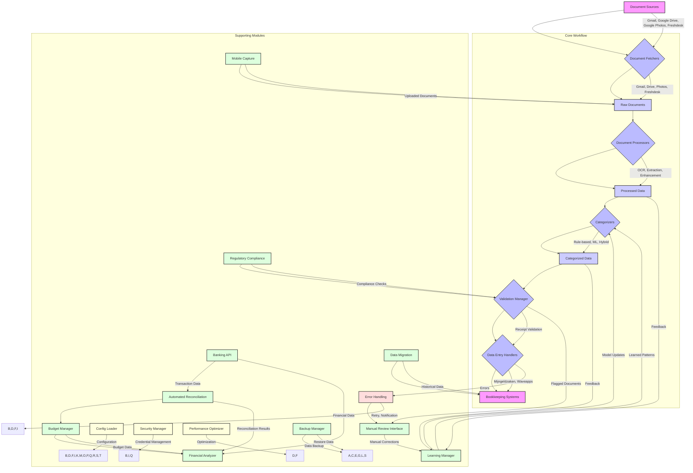

# Technical Reference for Automated Bookkeeping Solution

This document provides a detailed technical overview of the Automated Bookkeeping Solution, including its architecture, module interfaces, data flows, and key implementation details. It is intended for developers, system administrators, and anyone looking to understand or extend the system.

## 1. Architecture Overview

The Automated Bookkeeping Solution follows a modular, pipeline-based architecture, designed for extensibility and maintainability. Each core function (fetching, processing, categorization, data entry) is encapsulated within its own module, communicating through well-defined interfaces.



## 2. Module Interfaces and Data Flow

### 2.1. `src/workflow/controller.py` (`WorkflowController`)

*   **Purpose**: Orchestrates the entire document processing workflow. It initializes and coordinates all other modules.
*   **Key Methods**:
    *   `run_workflow()`: Main entry point for the workflow. Fetches documents, processes them through the pipeline, categorizes, validates, and dispatches to data entry handlers.
*   **Data Flow**: Pulls documents from fetchers, pushes to processors, then to categorizers, validators, and finally to data entry handlers.

### 2.2. `src/config_loader.py` (`ConfigLoader`)

*   **Purpose**: Manages application configuration, loading settings from `config.ini` and environment variables.
*   **Key Methods**:
    *   `get(section, key, default)`: Retrieves a specific configuration value.
    *   `get_section(section)`: Retrieves all key-value pairs for a given section.
    *   `get_all_config()`: Returns the entire loaded configuration as a dictionary.
*   **Data Flow**: Provides configuration data to all modules that require it.

### 2.3. `src/workflow/logger.py` (`AppLogger`)

*   **Purpose**: Centralized logging utility for the application.
*   **Key Methods**:
    *   `get_logger()`: Returns a configured Python `logging.Logger` instance.
*   **Data Flow**: Receives log messages from all modules and writes them to the configured log file or standard output.

### 2.4. `src/security/security_manager.py` (`SecurityManager`)

*   **Purpose**: Handles secure storage and retrieval of sensitive information (e.g., API keys, passwords) using encryption.
*   **Key Methods**:
    *   `encrypt_data(data)`: Encrypts a given string.
    *   `decrypt_data(encrypted_data)`: Decrypts an encrypted string.
*   **Data Flow**: Used by modules that handle sensitive credentials (fetchers, data entry handlers) to encrypt/decrypt data.

### 2.5. `src/document_fetchers/base.py` (`BaseFetcher`)

*   **Purpose**: Abstract base class defining the interface for all document fetching modules.
*   **Key Methods (Abstract)**:
    *   `fetch_documents() -> List[Dict[str, Any]]`: Fetches documents from a source and returns a list of dictionaries, each containing `id`, `original_filename`, `local_path`, and `source`.

### 2.6. `src/document_fetchers/gmail_fetcher.py` (`GmailFetcher`)

*   **Purpose**: Fetches email attachments from Gmail using the Gmail API.
*   **Dependencies**: `google-api-python-client`, `google-auth-oauthlib`.
*   **Configuration**: `gmail_credentials_file`, `gmail_token_file`, `gmail_attachment_download_dir`, `gmail_search_query`, `gmail_scanner_mode`, `gmail_trusted_senders`, `gmail_max_attachment_bytes`.
*   **Runtime Behavior**: Follows Gmail `nextPageToken` pages up to configured limits, traverses nested MIME parts, writes content-addressed files, and refuses to start interactive OAuth from an unattended worker unless `interactive_auth=true` is explicitly selected for supervised setup. Scanner mode additionally enforces an exact sender allowlist, PDF filename/MIME/magic-byte checks, bounded attachment size, stable message/attachment identity, per-item failure isolation, and read-only source retention. After a complete run, connector metadata advances a durable last-successful checkpoint; subsequent queries include a configurable overlap. A page/message cap is a partial run and never advances that checkpoint.

### 2.6.1. Gmail scanner activation

`LocalGmailAuthorizationCoordinator` and `/api/connectors/gmail/*` provide a loopback-only desktop OAuth setup flow. Credential JSON is schema/endpoint validated, written atomically with private permissions, and audited by hash without persisting secret values in the ledger. Credential rotation creates a reauthorization marker that blocks unattended collection until fresh consent succeeds. The React operator dashboard proxies only the fixed credential-install and read-only authorization endpoints; OAuth remains a user-owned browser action.

The scanner profile replaces the Gmail-to-Drive Apps Script from `Noodzakelijk-Online/025-Scan-to-folder-automation` at source commit `e3078d9`. FAB retains the exact HP ePrint sender/query signal but performs direct, content-addressed intake with provider checkpoints, PDF signature validation, duplicate/revision controls, and downstream OCR and bookkeeping processing.

### 2.7. `src/document_fetchers/drive_fetcher.py` (`DriveFetcher`)

*   **Purpose**: Fetches files from Google Drive using the Google Drive API.
*   **Dependencies**: `google-api-python-client`, `google-auth-oauthlib`.
*   **Configuration**: `google_drive_credentials_file`, `google_drive_token_file`, `google_drive_download_dir`, `google_drive_folder_id`, `google_drive_file_types`.
*   **Runtime Behavior**: Follows Drive `nextPageToken` pages up to configured limits, downloads binary files, exports supported Google-native documents to PDF, skips folders/unsupported native types, uses content-addressed paths, and does not launch unattended OAuth by default.

### 2.8. `src/document_fetchers/freshdesk_fetcher.py` (`FreshdeskFetcher`)

*   **Purpose**: Fetches attachments from Freshdesk tickets using the Freshdesk API.
*   **Dependencies**: `requests`.
*   **Configuration**: `freshdesk_api_key`, `freshdesk_domain`, `freshdesk_download_dir`, `freshdesk_ticket_status`.
*   **Runtime Behavior**: Traverses bounded ticket pages, includes ticket and conversation attachments, deduplicates provider attachment IDs, enforces request timeouts, and records partial provider failures without discarding evidence already fetched.

### 2.9. `src/document_fetchers/photos_fetcher.py` (`PhotosFetcher`)

*   **Purpose**: Retains the legacy Photos Library fetcher for compatibility only. Google's removed whole-library scopes make unattended library scanning unavailable; the worker therefore never invokes it.
*   **Dependencies**: `google-api-python-client`, `google-auth-oauthlib`, `requests`.
*   **Configuration**: New installations use `google_photos_mode=picker`, `google_photos_credentials_file`, a JSON `google_photos_picker_token_file`, and `google_photos_download_dir`. `python -m src.run_photos_picker_auth` performs the one-time supervised OAuth flow.
*   **Picker Runtime**: `GooglePhotosPickerClient` creates, polls, lists, downloads, and deletes Picker sessions through `photospicker.googleapis.com`. It follows media pagination, enforces read-only scope, rejects pickle tokens, validates `photos.google.com` picker links and `*.googleusercontent.com` media URLs before attaching authorization, rejects redirects, bounds item count/file size/timeouts, and persists no expiring base URLs.

### 2.10. `src/document_processors/base.py` (`BaseProcessor`)

*   **Purpose**: Abstract base class defining the interface for all document processing modules.
*   **Key Methods (Abstract)**:
    *   `process_document(file_path: str, **kwargs) -> Dict[str, Any]`: Processes a document and returns extracted data and OCR text.

### 2.11. `src/document_processors/vision_processor.py` (`VisionProcessor`)

*   **Purpose**: Uses Google Cloud Vision API for advanced OCR and document understanding.
*   **Dependencies**: `google-cloud-vision`.
*   **Configuration**: `google_vision_credentials_file`.

### 2.12. `src/document_processors/tesseract_processor.py` (`TesseractProcessor`)

*   **Purpose**: Uses Tesseract OCR engine for text extraction from images/PDFs.
*   **Dependencies**: `pytesseract`, `Pillow`.
*   **Configuration**: `tesseract_cmd`, `tesseract_lang`.

### 2.13. `src/document_processors/dutch_ocr_processor.py` (`DutchOcrProcessor`)

*   **Purpose**: Specialized Tesseract processor for Dutch language documents.
*   **Dependencies**: `pytesseract`, `Pillow`.
*   **Configuration**: `dutch_ocr_lang`.

### 2.14. `src/document_processors/handwritten_recognition_processor.py` (`HandwrittenRecognitionProcessor`)

*   **Purpose**: Processes documents to extract handwritten text using a specialized model.
*   **Dependencies**: (Assumes a custom model and its dependencies, e.g., `torch`, `torchvision` if PyTorch-based).
*   **Configuration**: `handwritten_model_path`.

### 2.15. `src/document_processors/template_matching_processor.py` (`TemplateMatchingProcessor`)

*   **Purpose**: Extracts structured data from documents based on predefined templates and keyword matching.
*   **Dependencies**: (None specific beyond Python built-ins).
*   **Configuration**: `template_matching_templates_dir`.

### 2.16. `src/document_processors/line_item_extractor.py` (`LineItemExtractor`)

*   **Purpose**: Extracts individual line items (e.g., product, quantity, price) from invoices or receipts.
*   **Dependencies**: (Potentially `re` for regex, `pandas` for data structuring).

### 2.17. `src/document_processors/enhanced_processor.py` (`EnhancedProcessor`)

*   **Purpose**: Combines multiple processing techniques (e.g., OCR + line item extraction) for comprehensive data extraction.
*   **Dependencies**: Depends on other processors.
*   **Configuration**: `ocr_processor`, `line_item_extraction_enabled`.

### 2.18. `src/document_processors/vendor_template_processor.py` (`VendorTemplateProcessor`)

*   **Purpose**: Extracts data based on vendor-specific templates and rules.
*   **Dependencies**: (None specific beyond Python built-ins).
*   **Configuration**: `vendor_templates_file`.

### 2.19. `src/document_processors/bilingual_processor.py` (`BilingualProcessor`)

*   **Purpose**: Detects document language and routes to the appropriate language-specific OCR processor (e.g., Dutch or English).
*   **Dependencies**: `langdetect`, `pytesseract`, `google-cloud-vision`.
*   **Configuration**: `tesseract_cmd`, `dutch_ocr_lang`, `google_vision_credentials_file`.

### 2.20. `src/document_processors/processor_factory.py` (`ProcessorFactory`)

*   **Purpose**: A factory class to create instances of various document processors based on configuration.
*   **Key Methods**:
    *   `create_processor(processor_type: str, config: Dict[str, Any])`: Returns an instance of the specified processor.

### 2.21. `src/document_processors/processor_pipeline.py` (`ProcessorPipeline`)

*   **Purpose**: Manages a sequence of document processors, allowing for a configurable processing pipeline.
*   **Key Methods**:
    *   `process_document(file_path: str, **kwargs)`: Runs the document through all configured processors in sequence.
*   **Configuration**: `processor_pipeline_steps` (a list of processor names and types).

### 2.22. `src/categorizers/base.py` (`BaseCategorizer`)

*   **Purpose**: Abstract base class defining the interface for all document categorization modules.
*   **Key Methods (Abstract)**:
    *   `categorize(processed_data: Dict[str, Any]) -> Dict[str, Any]`: Categorizes the processed document data.

### 2.23. `src/categorizers/rule_based_categorizer.py` (`RuleBasedCategorizer`)

*   **Purpose**: Categorizes documents based on predefined rules (keywords, vendors, etc.).
*   **Configuration**: `categorization_rules`.

### 2.24. `src/categorizers/fallback_categorizer.py` (`FallbackCategorizer`)

*   **Purpose**: Assigns a default category if other categorizers fail or return low confidence.
*   **Configuration**: `default_fallback_category`.

### 2.25. `src/categorizers/ml_categorizer.py` (`MLCategorizer`)

*   **Purpose**: Categorizes documents using a trained machine learning model.
*   **Dependencies**: `scikit-learn`, `joblib`.
*   **Configuration**: `ml_model_path`, `ml_vectorizer_path`, `ml_confidence_threshold`.
*   **Training**: This module also contains methods for training the ML model (`train_model`).

### 2.26. `src/categorizers/hybrid_categorizer.py` (`HybridCategorizer`)

*   **Purpose**: Combines rule-based and ML categorization, prioritizing rule-based results when applicable, and falling back to ML or default if confidence is low.
*   **Dependencies**: `RuleBasedCategorizer`, `MLCategorizer`, `FallbackCategorizer`.

### 2.27. `src/data_entry/base.py` (`BaseDataEntryHandler`)

*   **Purpose**: Abstract base class defining the interface for all data entry modules.
*   **Key Methods (Abstract)**:
    *   `enter_data(categorized_data: Dict[str, Any]) -> Dict[str, Any]`: Enters the categorized data into the target bookkeeping system.

### 2.28. `src/data_entry/mijngeldzaken_handler.py` (`MijngeldzakenHandler`)

*   **Purpose**: Automates data entry into mijngeldzaken.nl using browser automation (Playwright).
*   **Dependencies**: `playwright`.
*   **Configuration**: `mijngeldzaken_export_dir`, `mijngeldzaken_default_account`, `mijngeldzaken_csv_delimiter`, `mijngeldzaken_csv_template`, `mijngeldzaken_category_mapping`.
*   **Safety**: FAB does not use stored MijnGeldzaken usernames, passwords, or DigiD credentials. Approved entries become checksum-bound CSV artifacts and pause in `supervision_required` until the operator completes the import in a user-owned session and records the result in FAB.

### 2.29. `src/data_entry/waveapps_business_handler.py` (`WaveappsBusinessHandler`)

*   **Purpose**: Enters expense data into Waveapps Business account via Waveapps GraphQL API.
*   **Dependencies**: `requests`.
*   **Configuration**: Encrypted local dashboard setup or `waveapps_business_access_token`, `waveapps_business_id`, `waveapps_business_category_mapping`. `GET/PUT /api/wave/setup` and `POST /api/wave/setup/validate` expose only non-secret status and verified account options.

### 2.30. `src/data_entry/waveapps_personal_handler.py` (`WaveappsPersonalHandler`)

*   **Purpose**: Enters expense data into a Waveapps Personal account via Waveapps GraphQL API.
*   **Dependencies**: `requests`.
*   **Configuration**: Encrypted local dashboard setup or `waveapps_personal_access_token`, `waveapps_personal_id`, `waveapps_personal_category_mapping`, `waveapps_handicap_tag`.

### 2.31. `src/learning/learning_manager.py` (`LearningManager`)

*   **Purpose**: Orchestrates the learning process, including analyzing historical data from bookkeeping systems and incorporating user feedback.
*   **Key Methods**:
    *   `learn_from_existing_data()`: Triggers analysis of data from Waveapps and Mijngeldzaken.
    *   `provide_feedback(document_id, original_category, corrected_category)`: Records user corrections for future learning.
    *   `get_learned_patterns(source)`: Retrieves learned patterns (e.g., vendor-category mappings).
*   **Dependencies**: `WaveappsAnalyzer`, `MijngeldzakenAnalyzer`, `FeedbackLearner`.

### 2.32. `src/learning/waveapps_analyzer.py` (`WaveappsAnalyzer`)

*   **Purpose**: Analyzes historical transaction data from Waveapps to identify categorization patterns.
*   **Dependencies**: `requests`.
*   **Configuration**: `waveapps_business_access_token`, `waveapps_business_id`.

### 2.33. `src/learning/mijngeldzaken_analyzer.py` (`MijngeldzakenAnalyzer`)

*   **Purpose**: Analyzes historical transaction data from mijngeldzaken.nl (e.g., from CSV exports) to identify categorization patterns.
*   **Dependencies**: `pandas`.
*   **Configuration**: `mijngeldzaken_export_file_path`.

### 2.34. `src/learning/feedback_learner.py` (`FeedbackLearner`)

*   **Purpose**: Records and manages user feedback on categorization, which can be used to retrain ML models or refine rules.
*   **Configuration**: `feedback_log_file`.

### 2.35. `src/learning/enhanced_learning_system.py` (`EnhancedLearningSystem`)

*   **Purpose**: Integrates all learning components to provide a comprehensive and adaptive learning system. Handles model retraining based on feedback.
*   **Dependencies**: `LearningManager`, `FeedbackLearner`, `MLCategorizer`.

### 2.36. `src/error_handling/enhanced_error_recovery.py` (`EnhancedErrorRecovery`)

*   **Purpose**: Provides robust error handling, including retry mechanisms and error notifications.
*   **Key Methods**:
    *   `execute_with_retry(func, operation_name, *args, **kwargs)`: Executes a function with retry logic.
    *   `handle_error(exception, operation_name)`: Logs the error and triggers notifications/manual review if configured.
*   **Configuration**: `error_recovery_max_retries`, `error_recovery_retry_delay_seconds`, `email_notifications_enabled`.

### 2.37. `src/error_handling/manual_review.py` (`ManualReviewInterface`)

*   **Purpose**: Manages a queue of documents that require manual review due to processing errors or low confidence categorization.
*   **Key Methods**:
    *   `add_to_review_queue(document_id, reason, details)`: Adds a document to the queue.
    *   `get_pending_reviews()`: Retrieves documents awaiting review.
    *   `mark_reviewed(document_id, new_status, resolution)`: Marks a document as reviewed.
*   **Configuration**: `manual_review_queue_file`.

### 2.38. `src/performance/batch_processor.py` (`BatchProcessor`)

*   **Purpose**: Processes documents in batches to improve efficiency and reduce overhead.
*   **Key Methods**:
    *   `process_batch(items, processing_function)`: Applies a processing function to a list of items in batches.

### 2.39. `src/performance/cache_manager.py` (`CacheManager`)

*   **Purpose**: Caches frequently accessed data or results of expensive operations to improve performance.
*   **Key Methods**:
    *   `set(key, value, ttl)`: Stores data in the cache.
    *   `get(key)`: Retrieves data from the cache.
    *   `clear(key)`: Removes data from the cache.
*   **Configuration**: `cache_dir`.

### 2.40. `src/performance/performance_optimizer.py` (`PerformanceOptimizer`)

*   **Purpose**: Identifies and implements performance optimizations across the system.
*   **Key Methods**:
    *   `optimize_processing_pipeline(pipeline)`: Applies optimizations to the document processing pipeline.
    *   `profile_resource_usage()`: Monitors and reports on CPU/memory usage.

### 2.41. `src/mobile_capture/mobile_document_capture.py` (`MobileDocumentCapture`)

*   **Purpose**: Provides an interface for integrating with mobile document capture solutions (e.g., uploading images from a mobile app).
*   **Configuration**: `mobile_capture_upload_dir`.

### 2.42. `src/reconciliation/automated_reconciliation.py` (`AutomatedReconciliation`)

*   **Purpose**: Automatically reconciles processed transactions with bank statements or other financial records.
*   **Key Methods**:
    *   `reconcile(transactions, receipts)`: Normalizes localized values and selects the highest-confidence amount, date, and vendor match.
*   **Configuration**: `reconciliation_threshold`, `reconciliation_match_threshold`, `reconciliation_date_tolerance_days`, `reconciliation_use_absolute_amounts`.

### 2.43. `src/compliance/regulatory_compliance.py` (`RegulatoryCompliance`)

*   **Purpose**: Ensures that processed documents and data entry comply with relevant financial regulations (e.g., GDPR, local tax laws).
*   **Key Methods**:
    *   `check_compliance(document_data)`: Checks a document against predefined compliance rules.
*   **Configuration**: `compliance_rules_file`.

### 2.44. `src/validation/receipt_validator.py` (`ReceiptValidator`)

*   **Purpose**: Validates extracted data from receipts against predefined rules (e.g., presence of required fields, format of BTW numbers).
*   **Key Methods**:
    *   `validate_receipt(processed_data)`: Checks the validity of extracted receipt data.
*   **Configuration**: `receipt_validation_required_fields`, `btw_number_pattern`.

### 2.45. `src/validation/validation_manager.py` (`ValidationManager`)

*   **Purpose**: Orchestrates various validation checks on processed documents.
*   **Key Methods**:
    *   `validate_document(document_data)`: Runs all configured validators on a document.
*   **Dependencies**: `ReceiptValidator`.

### 2.46. `src/migration/data_migration.py` (`DataMigration`)

*   **Purpose**: Handles the migration of historical financial data from old systems or formats into the new system.
*   **Key Methods**:
    *   `migrate_data()`: Executes the data migration process.
*   **Configuration**: `migration_source_db`, `migration_target_db`.

### 2.47. `src/migration/migration_wizard.py` (`MigrationWizard`)

*   **Purpose**: Provides a guided interface for users to perform data migrations.

### 2.48. `src/budget/budget_manager.py` (`BudgetManager`)

*   **Purpose**: Manages budget definitions and tracks spending against budgets.
*   **Key Methods**:
    *   `check_budget(category, amount)`: Checks if a transaction fits within the budget for a given category.
    *   `update_budget(category, amount)`: Updates spent amount for a category.
*   **Configuration**: `budget_file`.

### 2.49. `src/banking/banking_api.py` (`BankingAPI`)

*   **Purpose**: Integrates with external banking APIs to fetch transaction data.
*   **Key Methods**:
    *   `fetch_transactions(start_date, end_date)`: Retrieves transactions within a date range.
*   **Configuration**: `banking_api_endpoint`, `banking_api_credentials`.

### 2.50. `src/financial_analysis/financial_analyzer.py` (`FinancialAnalyzer`)

*   **Purpose**: Generates financial reports and provides insights based on processed and categorized data.
*   **Key Methods**:
    *   `generate_report(transactions)`: Creates a summary report of income, expenses, and other financial metrics.

### 2.51. `src/backup/backup_manager.py` (`BackupManager`)

*   **Purpose**: Manages the backup and restoration of application data and configurations.
*   **Key Methods**:
    *   `perform_backup(paths_to_backup, backup_config)`: Creates a backup archive.
    *   `restore_backup(backup_file_path, restore_dir)`: Restores data from a backup.
*   **Configuration**: `backup_base_dir`, `backup_paths`, `backup_config`.

### 2.52. `src/cloud_functions.py`

*   **Purpose**: Contains Google Cloud Functions entry points for serverless deployment.
*   **Key Functions**:
    *   `process_document_cloud_function(cloud_event)`: Triggered by GCS events for single document processing.
    *   `trigger_workflow_http(request)`: HTTP triggered function to start the full workflow.

### 2.53. `src/integration.py`

*   **Purpose**: This module serves as a central point for integrating various components and demonstrating end-to-end workflows. It might contain higher-level functions that combine functionalities from multiple modules for specific use cases or external system interactions.

## 3. Data Structures

### 3.1. Document Dictionary

Documents are represented as Python dictionaries with the following common structure:

```python
{
    "id": "unique_document_id",
    "original_filename": "invoice_123.pdf",
    "local_path": "/path/to/downloaded/file.pdf",
    "source": "gmail" | "google_drive" | "freshdesk" | "google_photos" | "mobile_capture",
    "ocr_text": "Extracted text from OCR",
    "extracted_data": {
        "vendor_name": "ABC Corp",
        "total_amount": 123.45,
        "currency": "EUR",
        "transaction_date": "2025-01-20",
        "invoice_number": "INV-2025-001",
        "line_items": [
            {"description": "Product A", "quantity": 1, "unit_price": 100.00, "total": 100.00},
            {"description": "Shipping", "quantity": 1, "unit_price": 23.45, "total": 23.45}
        ],
        "btw_number": "NL123456789B01",
        # ... other extracted fields
    },
    "language": "en" | "nl",
    "category": "Personal" | "Business" | "Handicaps" | "Manual Review" | "Uncategorized",
    "confidence_score": 0.98, # For categorization
    "validation_status": {
        "is_valid": True,
        "errors": []
    },
    "budget_check": {
        "is_within_budget": True,
        "remaining": 50.00
    },
    "reconciliation_status": {
        "is_reconciled": True,
        "matched_transaction_id": "tx_abc123"
    }
}
```

### 3.2. Configuration Dictionary

Loaded from `config.ini` and environment variables, typically accessed via `ConfigLoader`.

```python
{
    "app": {"log_file": "logs/app.log"},
    "gmail": {
        "credentials_file": "credentials/gmail_credentials.json",
        "token_file": "tokens/gmail_token.json",
        "attachment_download_dir": "downloads/gmail",
        "search_query": "has:attachment"
    },
    # ... other sections
}
```

## 4. Testing Strategy

The project employs a comprehensive testing strategy including:

*   **Unit Tests**: Located in `tests/test_*.py` files, these tests verify the functionality of individual modules in isolation.
*   **Integration Tests**: `tests/test_integration.py` focuses on testing the interaction between multiple modules and the end-to-end workflow.
*   **Mocking**: The `unittest.mock` library is extensively used to isolate components during testing and simulate external API calls or file system interactions.

To run all tests:

```bash
python -m unittest discover tests
```

## 5. Deployment Considerations

### 5.1. Local/On-Premise

*   **Resource Requirements**: CPU, RAM, and storage depend on the volume and complexity of documents. OCR can be CPU-intensive.
*   **Dependencies**: Ensure Tesseract OCR and Playwright browser dependencies are correctly installed on the host system.
*   **Scheduling**: Run `python -m src.run_worker` for a long-lived interval worker, or set `worker_run_once=true` and schedule that command through `cron` or Windows Task Scheduler.
*   **Checkpoint Durability**: Terminal document states and duplicate fingerprints are atomically persisted after each transition by default. Set `workflow_checkpoint_autosave=false` only when reduced disk activity is more important than minimizing replay after an interrupted run.
*   **Checkpoint Failures**: A failed final checkpoint write marks the workflow run as failed and records an operations audit event, because reporting success without durable idempotency state could cause duplicate posting.
*   **Checkpoint Serialization**: Financial decimals are persisted without float conversion, dates use ISO-8601, paths become strings, unordered collections are sorted, and binary values are represented by size and SHA-256 metadata. This keeps valid OCR/provider values from breaking restart state.
*   **Corrupt Checkpoints**: Existing unreadable or structurally invalid checkpoint files block source fetching by default and produce a failed operations run with a `checkpoint_load` audit event. The damaged file is preserved to avoid silently replaying historical documents.
*   **Overlapping Runs**: The legacy source workflow keeps its atomic checkpoint-file run lock. The operations-ledger autonomous cycle uses the SQLite `runtime_leases` table, ownership-checked release, and `fab_autonomy_lease_seconds` expiry so the worker, Task Scheduler, and repeated HTTP triggers cannot overlap on one ledger. Multi-host deployments must share the SQLite ledger safely or use a distributed scheduler/database lease.
*   **Workflow Step Evidence and Governed Recovery**: `workflow_steps` belongs to each `workflow_runs` record and stores the ordered step key, stage, status, attempt, start/finish timestamps, duration, bounded error, and redacted metadata. `LocalAutonomousService` creates the 12 actual executor boundaries up front, marks skipped gates explicitly, records the exact failed action, and marks unexecuted downstream actions `not_run`. `LocalConnectorIntakeService` records one timed step per selected source and uses a global SQLite lease so API and worker syncs cannot overlap. `LocalWorkflowRecoveryService` uses immutable evidence to plan a linked retry: connector recovery reruns only failed read-only sources, while autonomous recovery reruns only the first actual failed low-risk step and never selects `execute_approved_exports`. Each retry creates a new workflow run with source/root run IDs, retry depth, selected step keys, and incremented attempt numbers; a per-source-run SQLite lease prevents duplicate retries. `LocalWorkflowRecoveryScheduler` runs before normal worker intake, applies bounded exponential backoff and a retry-depth cap, and holds deferred failed connector sources out of the normal sync stage so backoff cannot be bypassed. A stale running connector/autonomy run is finalized as interrupted only after its corresponding runtime lease is inactive, after which the normal governed retry policy applies. The original run remains unchanged and becomes superseded by its recovery child. The dashboard Workflow Runs panel, `GET /api/workflows/recovery`, authenticated `POST /api/workflows/recovery/run-due`, `GET /api/workflows/{id}/recovery-plan`, and authenticated `POST /api/workflows/{id}/retry` expose the controls. Replay of external actions remains prohibited.
*   **Duplicate Evidence**: Exact duplicate suppression requires a shared invoice/receipt/order number or the vendor, transaction date, and amount trio. Fuzzy suppression requires at least three comparable populated fields; missing values do not contribute matching score. Amounts are normalized across formats such as `1.234,56` and `1,234.56`.
*   **Wave Autonomous Operator**: Wave actions are modeled as explicit capabilities with required fields and safety levels. Read-only and safe-draft actions can run through configured executors when the plan is complete. High-impact actions such as sending invoices, marking bills paid, connecting bank feeds, changing user access, or connecting external integrations are prepared and queued only after explicit confirmation or credential authorization. Each operation receives a deterministic idempotency key for auditability and replay protection.
*   **Autonomous Bookkeeper Playbook**: Competitor-informed orchestration maps FAB's continuous bookkeeping loop across collection, OCR validation, categorization, reconciliation, exception chasing, month-end close, learning, and app-layer execution. Each capability declares required signals, linked Wave actions, review gates, audit events, and autonomy level so the Python workflow, Wave operator, and admin UI share the same policy model.
*   **Local Wave Control Center**: `LocalWaveControlService` exposes the modeled Wave menu/action catalog, a structured Reports registry, credential presence without secret values, and policy-gated operation planning through `/api/wave`, `/api/wave/actions`, `/api/wave/reports`, `/api/wave/reports/plan`, `/api/wave/report-snapshots`, `/api/wave/plan`, and `/api/wave/workflows/plan`. `/api/wave/account-mappings` reports local anchor/category mapping readiness, while `/api/wave/accounts/discover` performs an audited, quota-guarded, read-only chart-of-accounts refresh and persists the result as Wave operation evidence without exposing OAuth tokens. `WaveappsEntitySyncService` follows Wave's paginated customer, product/service, and invoice query contracts; `/api/wave/entities/sync` writes those records into the generic `wave_entities` mirror and records each run in `wave_sync_runs`. Only a duplicate-free traversal whose unique ID count matches Wave's stable reported total may mark formerly known IDs as `missing_downstream`; partial, inconsistent, or failed reads never make that destructive inference. `/api/wave/entities` and `/api/wave/entity-sync-runs` expose the mirror, dashboard controls show its status, and operations health flags stale/failed syncs and missing downstream records. The control center also plans general-ledger, trial-balance, sales-tax, customer/vendor, and period-close report workflows with deterministic operation IDs, persists Wave report snapshots for report type, period, basis, account/contact scope, export format, safety, and workflow provenance, but marks every plan as `externalSubmission=not_executed` until a separate approved Wave API or browser executor is attached.
*   **Local Bank Transaction Ledger**: `LocalBankTransactionImportService` and `LocalOperationsLedger` persist bank statement imports and normalized bank/account transactions in SQLite. The dashboard Bank Transactions panel and `/api/bank-transactions` plus `/api/bank-transactions/import` accept JSON, CSV, CAMT XML, and MT940-style statement rows, normalize localized amounts/dates, maintain idempotency by account and transaction id, redact secret-looking metadata keys, and expose imported transactions as reconciliation-ready evidence without sending data externally.
*   **Normalized Bookkeeping Records**: `LocalBookkeepingRecordService` keeps the `bookkeeping_records` and `bookkeeping_record_line_items` tables in sync with source documents, imported bank rows, review corrections, Wave draft routing, and reconciliation decisions. Records capture the source link, record type, vendor, category, date, amount, VAT/BTW, currency, target system/account, confidence, review-required flag, export status, reconciliation status, redacted metadata, and child line items with description, quantity, amount, tax amount/rate/code, category, account mapping, source, and confidence. The dashboard Bookkeeping Records panel plus `/api/bookkeeping-records`, `/api/bookkeeping-records/{id}`, and `/api/bookkeeping-records/{id}/line-items` expose this as FAB's current operating source of truth; `/api/bookkeeping-records/refresh` rebuilds records from existing document ledger state.
*   **Local Financial Reports**: `LocalFinancialReportingService` builds period-filtered P&L, VAT position, bank cash movement, category spending, and vendor spending directly from normalized bookkeeping records. Accrual reports use document evidence plus standalone unreconciled bank records; approved/reconciled bank records are excluded when the matched document already represents the expense or income. Cash-basis reports use bank records only. Totals remain separated by currency, rejected/ignored/duplicate/failed records are excluded explicitly, and undated, review-required, unmapped, unreconciled, or truncated inputs appear as completeness gates. `GET /api/reports` is read-only and supports `reportType`, `basis`, `fromDate`, `toDate`, `targetSystem`, `includeRows`, and JSON/CSV formats. `POST /api/reports` records an audit event. `LocalScheduledReportService` adds daily, weekly, or monthly schedule slots in `Europe/Amsterdam` (or another configured IANA timezone), atomically claims each slot in `financial_report_runs`, derives previous-month/current-period/previous-quarter dates, writes local JSON/CSV files atomically, records SHA-256 and size evidence, verifies artifacts before serving them, and defers failed retries. The recurring worker runs this as an isolated stage; `/api/report-runs`, `/api/report-runs/run-due`, `/api/report-runs/{id}`, and `/api/report-runs/{id}/artifact` expose status and verified artifacts. Reports with completeness blockers are retained as `prepared_needs_review`. All reports remain `provisional`, `not_filed`, and `externalSubmission=not_executed`; Wave report evidence remains authoritative for official downstream close controls, and no email or filing is performed.
*   **Local Notification Center**: `LocalNotificationService` converts `LocalOperationsHealth` issues into durable `notifications` rows with stable fingerprints, severity, evidence, source entity, read/acknowledged/resolved state, and automatic resolution when the underlying issue clears. `notification_preferences` provides per-event or wildcard in-app enablement and minimum-severity controls. The recurring worker refreshes notifications as an isolated stage. The dashboard and `/api/notifications`, `/api/notifications/refresh`, `/api/notifications/{id}/status`, and `/api/notification-preferences` expose the inbox and audited controls. The Wave invoice mirror contributes overdue and due-soon events while paid/cancelled/void/deleted invoices are excluded. Sensitive payload keys are redacted. External delivery is deliberately `disabled`/`not_executed`; no email, Slack message, reminder, or customer contact is sent.
*   **Local VAT and Compliance Evidence**: `LocalComplianceService` creates checksum-keyed current-quarter or explicit-period accrual assessments from normalized records and the provisional VAT report. `compliance_assessments` stores period, source checksum, VAT totals, readiness, and `statutory_status=provisional`; `compliance_findings` stores record-linked VAT inconsistencies, missing tax codes, unsupported rates, foreign-currency conversion requirements, report completeness gates, and missing source files with review lifecycle; `retention_records` stores source dates and seven-year retain-until evidence without authorizing deletion. New assessments supersede open findings from older source snapshots. The worker evaluates compliance before refreshing notifications. `/api/compliance/assessments`, `/api/compliance/assessments/{id}`, `/api/compliance/findings`, `/api/compliance/findings/{id}/status`, and `/api/compliance/retention` expose the evidence. Closing a finding requires a reason. No Belastingdienst filing, legal conclusion, source deletion, or external submission occurs; all responses retain `filingStatus=not_filed` and `externalFiling=not_executed`.
*   **Local Folder Intake**: The local operations API can rescan configured local or Google Drive-synced folders, stream files to SHA-256 duplicate fingerprints, register metadata idempotently in SQLite, and open duplicate review items without storing raw attachment bytes.
*   **Local Connector Intake and Source Registry**: `LocalConnectorIntakeService` independently plans and synchronizes explicitly enabled Gmail, Google Drive, and Freshdesk sources before autonomous processing. A durable runtime lease prevents overlapping API, worker, and recovery syncs. Each run writes a workflow record, source-account status/counters, provider provenance, document evidence, exact-content duplicate state, provider-side revision review work, and audit evidence while keeping `externalSubmission=not_executed`. A failure in one connector cannot suppress the others, and partial runs preserve already downloaded evidence. The unattended worker selects only currently syncable sources; unconfigured sources and supervised Google Photos Picker sessions remain visible without generating empty background workflows. `/api/sources/readiness`, `POST /api/sources/sync`, the Sources dashboard panel, and the worker expose this control plane; `/api/sources` retains the observed registry. Secret-like metadata and errors are recursively redacted before persistence.
*   **Supervised Google Photos Intake**: `LocalGooglePhotosPickerService` stores Picker lifecycle state in `workflow_runs` under `google_photos_picker`, prevents parallel/leaked sessions, exposes the user-owned `pickerUri`, polls only after an explicit dashboard/API action, and registers selected photos through `LocalFolderIntake`. Duplicate, provider-revision, source-account, review, audit, health, and notification behavior is therefore shared with every other intake path. Clean collection deletes the provider session; partial imports remain retryable and stale/live sessions remain visible. `GET/POST /api/sources/google-photos/sessions`, `GET .../{id}`, `POST .../{id}/collect`, and `POST .../{id}/cancel` expose the workflow. No worker selects media or opens OAuth, and `externalSubmission` remains `not_executed` because the flow imports user-selected evidence rather than posting bookkeeping data.
*   **Local Document Processing**: Imported ledger documents can be processed from the dashboard/API. Text files are parsed locally, other files use the configured processor pipeline, and extracted fields, category confidence, validation results, review gates, and audit events are written back to SQLite. Strong vendor names, enumerated OCR aliases in the receipt header, and the stable Lidl terminal merchant identifier can recover vendor identity without lowering the required-field confidence threshold; the matched evidence, canonicalization decision, source policy, and actual validator confidence are persisted as field evidence. Labeled Dutch `Datum` lines outrank conflicting unlabelled dates, while impossible future years are discarded before validation. Reference extraction requires identifier-shaped values with digits, preventing OCR prose such as `staat` or `Payment` from becoming invoice identity. Duplicate matching uses the same validated-reference rule, compares a newly processed document only with earlier ingested canonical records, and creates a pending review candidate without writing a confirmed `duplicate_of_document_id`. The autonomous processing pass revalidates legacy open pairs from current structured evidence, canonicalizes reciprocal rows, and clears only disproven machine-created duplicate gates behind a checksum-bound backup; source files and confirmed links are never modified. A separate guarded repair pass clears cyclic confirmed links while retaining every source file, candidate, and review. The bounded trusted-category policy may resolve category-only blockers for exact matches in FAB's fixed vendor taxonomy at or above the 0.95 policy floor, including documents that remain blocked by a separate duplicate-candidate review; confirmed duplicates, fuzzy/model suggestions, and every non-category gate remain untouched. Each processing run also refreshes `extracted_fields` rows for vendor, date, amount, VAT/BTW, currency, line items, and category with field-level confidence and provenance so review screens and downstream learning can inspect evidence without scraping raw OCR text.
*   **Review Corrections and Suggested Rules**: Manual review decisions now persist correction history, apply corrected vendor/category/date/amount fields to the document ledger, and create suggested vendor/category rules. Suggested rules are auditable learning records and are not broad auto-posting authorization.
*   **Local Routing Drafts**: Reviewed or processed ledger documents can be converted into Wave action plans through `LocalRoutingService`. The service validates required source fields, records a `routing_attempts` row with the Wave surface/action/payload/idempotency key, updates the document to `export_draft_prepared`, and records audit events. Missing export fields create review items. This is draft preparation only; external Wave submission remains approval-gated and is not performed by the local dashboard route.
*   **Local Export Attempts**: `LocalExportAttemptService` turns prepared routing attempts into durable `export_attempts` rows with target system, surface/action, operation id, payload snapshot, approval status, external-submission state, result evidence, and redacted metadata. This table is the posting source of truth used by the dashboard, autonomous cycle, background worker, and manual approved-posting runner. Execution uses an atomic `execution_in_progress` claim and creates a checksum-protected ledger backup before each approved batch. `WaveappsApiExecutor` connects approved `transaction_add` actions to the existing Business/Personal `moneyTransactionCreate` handlers, carries the operation ID into Wave idempotency data, persists the returned Wave ID, blocks ambiguous target accounts, and creates review work instead of reporting unsupported actions as queued. Quota throttles become durable `deferred` attempts with a due time. MijnGeldzaken attempts persist a checksum-bound CSV/JSON artifact, change to `supervision_required`, and open a review item until `RECORD FAB EXPORT RESULT` records the supervised outcome. Legacy `posting_attempts` remain compatibility-only and are not polled unless explicitly enabled.
*   **Local Reconciliation**: `LocalReconciliationService` reuses the existing amount/date/vendor reconciliation engine against local ledger documents and imported bank transactions. It records `reconciliation_matches`, updates document-level and bank-transaction-level `reconciliation_status`, opens review items for candidate matches, missing receipts, or unmatched documents, and audits every run and resolution. `LocalReviewService` now treats reconciliation review items as evidence-linked decisions: approving a candidate reconciles the document and linked bank transaction, while resolving or ignoring missing-receipt exceptions closes the match and bank transaction without mutating Wave.
*   **Local Ledger Backups**: `LocalBackupService` snapshots the SQLite operations ledger through SQLite's backup API, writes a manifest with size/checksum/config summary, lists and validates backup archives, and requires the exact confirmation phrase `RESTORE FAB LOCAL LEDGER` before restoring. Restore creates a pre-restore backup and records audit events before and after replacement; unsafe ZIP paths or archives outside the configured backup directory are rejected.
*   **Local Operations Health**: `LocalOperationsHealth` converts ledger state into an actionable health summary for `/api/health` and the dashboard. It flags stale review items, stuck imported/processing/review documents, failed documents, routing blocks, prepared routing drafts waiting too long for approval/export, stuck atomic export claims, stale running workflow runs, failed workflow runs, failed/partial/stale source connectors, report failures, Wave mirror drift, unsettled Wave invoice deadlines, and findings from the latest compliance assessment. Thresholds are configurable through `[operations] review_stale_hours`, `document_stale_hours`, `routing_stale_hours`, `workflow_stale_hours`, `source_stale_hours`, `export_execution_stale_hours`, `report_stale_hours`, and `invoice_due_soon_days`.
*   **Local Readiness Settings**: `LocalReadinessService` powers `/api/settings`, the Settings panel, and the compact readiness block inside `/api/health`. It checks local ledger/backup/intake paths, source readiness for local folders, Gmail, Drive, Photos, Freshdesk, Wave, MijnGeldzaken, OCR, and banking, dependency availability for Tesseract, Playwright, Flask, Google clients, Pillow, and SQLite, and remote API exposure safety. Credential values are never returned; only configured/missing/file-exists status and secret key names are exposed.
*   **Local Autonomous Cycle**: `LocalAutonomousService` powers `/api/autonomy/plan`, `/api/autonomy/run`, the recurring `FabWorker`, and the Autonomous Cycle dashboard panel. It combines readiness, operations health, intake state, review queues, routable documents, trusted exact-vendor category candidates, pending routing drafts, imported bank transactions, reconciliation candidates, and Wave workflow planning into one policy-gated run loop. Local intake, processing, bounded trusted-category application, draft preparation, reconciliation candidates, stale-draft regeneration, and read-only planning can run automatically. For configured Wave targets, the `refresh_wave_entity_mirror` action refreshes customers, products/services, and invoices before routing when no prior sync exists, the mirror is stale, or a failed run has passed its retry window. `includeWaveSync=false` or `fab_autonomy_sync_wave_entities=false` keeps this manual-only; sync failures become attention evidence and do not abort unrelated local bookkeeping work. Real runs acquire the `local_autonomous_cycle` SQLite runtime lease; concurrent triggers receive `409 already_running`, while dry runs remain non-mutating. The worker runs durable connector intake first, then local autonomy, reports, compliance, notifications, operations exports, and compatibility queues as isolated audited stages. The old checkpoint workflow remains opt-in through `worker_run_legacy_workflow`; it is off by default. Approved exports run only through their configured worker/autonomy execution gates; they remain approval-bound and preflight-backed-up. MijnGeldzaken external submission remains supervised. Remote exposure blocks, non-category review decisions, draft approvals, credential changes, backup restore, deletion, and outbound messages remain outside automatic execution.

### 5.2. Google Cloud Functions

*   **Statelessness**: Cloud Functions are stateless. Ensure all necessary data (e.g., `token.json` files, ML models) are either part of the deployment package, stored in Cloud Storage, or accessed via other persistent services.
*   **Cold Starts**: Be aware of cold start latencies, especially for functions with large dependencies (like Tesseract or Playwright).
*   **Memory/CPU**: Configure appropriate memory and CPU for functions. OCR and Playwright can be memory-intensive.
*   **Environment Variables**: Use environment variables for configuration and secrets. Google Secret Manager is recommended for sensitive data.
*   **Triggers**: Configure GCS triggers for event-driven processing or HTTP triggers for on-demand workflow execution.

## 6. Future Improvements and Extensibility

*   **Database Integration**: Implement a database (e.g., PostgreSQL, SQLite) for persistent storage of processed documents, categorization rules, and learned patterns, moving away from JSON files for larger scale.
*   **Web UI**: Develop a full-fledged web user interface for document review, configuration management, and reporting.
*   **More Integrations**: Add support for more document sources (e.g., email providers other than Gmail, other cloud storage services) and bookkeeping systems.
*   **Advanced ML**: Explore more sophisticated machine learning models for OCR post-processing, entity extraction, and categorization.
*   **Container Orchestration**: For larger deployments, consider container orchestration platforms like Kubernetes (GKE) for managing Docker containers.

## 7. Troubleshooting Guidelines

*   **Check Logs**: The primary source of debugging information. Configure logging levels for more verbosity if needed.
*   **Environment Variables**: Verify that all required environment variables are correctly set, especially in deployed environments.
*   **Dependency Conflicts**: Use `pip freeze > requirements.txt` to capture exact versions and `pip check` to find conflicts.
*   **API Quotas**: Ensure you are not hitting API rate limits or daily quotas for Google APIs or other third-party services.
*   **Playwright Headless Mode**: If Playwright fails in a headless environment, ensure all necessary system libraries are installed (e.g., `libnss3`, `libfontconfig`, `libgbm`).


